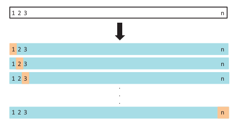

# Vamos falar de

- Viés e variância

- Erro de treino e erro de teste

- Hiperparâmetros 

- Validação cruzada

- CARET

- Avaliação de Modelos

- Regularização

---


# Viés e variância


---

# Estimando a performance do modelo

- **Erro de treino**: é o erro encontrado ao aplicar o modelo na própria base utilizada para treiná-lo.

- **Erro de teste**: é o erro encontrado ao aplicar o modelo a uma base não utilizada no treino.


**Validação cruzada** é usada para aprimorar a estimativa do **erro de teste** sem comprometer a qualidade das estimativas!


---

# Hiperparâmetros

Hiperparâmetros são parâmetros ligados à complexidade do modelo que devem ser escolhidos antes do ajuste.

Por exemplo, considere um modelo polinomial:

$$f(X) = \beta_0  + \beta_1 * X + \beta_2 * X^2 + \beta_3 * X^3 + \cdots + \beta_{p} * X^{p}$$

Para selecionar o melhor $p$ podemos utilizar **validação cruzada** (método de reamostragem para estimar o erro preditivo de um modelo).

--

- Leave-one-out cross-validation (LOOCV)
- K-fold cross-validation

---

# k-fold

- geralmente, k = 5 ou k = 10.

```{r}
knitr::include_graphics("img/k-fold-cv.png")
```

---

# LOOCV

- caso particular, apenas para conhecimento. Computacionalmente inviável.

```{r}

```

---

# Atenção especial quando o tempo está envolvido.


---

# Exemplo no R


